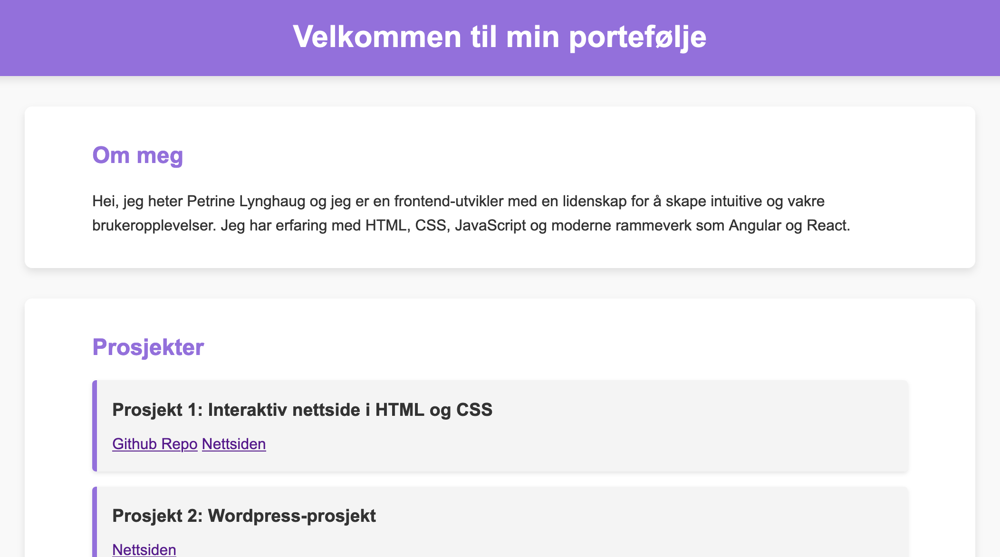

# Portofolio 1.
https://epetrinelynghaug.github.io/




## Description
Portfolio 1 is the final assignment we have for this year after the exams. The task is to create a portfolio that includes 3 projects completed in a school context, present them, and showcase them at a later date.


## Built With

You can list a the tech stack that you've used over here
- HTML 
- CSS
- JavaScript

## Getting Started

### Installing

1. Clone the repo:

```bash
git git@github.com:EPetrineLynghaug/EPetrineLynghaug.github.io.git
```

## Contact

- [My LinkedIn page](https://www.linkedin.com/in/petrine-lynghaug/)
- Petrinelynghaug@gmail.com